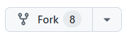
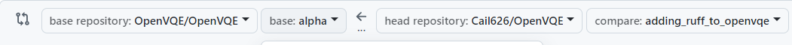

## Introduction

OpenVQE is distributed under the MIT license. By contributing, you agree to license your work under MIT. 
To be part of our community, you can join our discord server([link here](https://discord.gg/fBr5MQ34)) or you can contact Dr. Mohammad( email: mohammadhaidar2016@outlook.com).

## Code Integration Checklist

Before adding your code to OpenVQE, please follow this checklist. If you have any questions or need help, feel free to reach out to Nathan at [nathanvaneberg@gmail.com](mailto:nathanvaneberg@gmail.com) for assistance with integrating your code.

- [ ] The file `requirements.txt`([link here](https://github.com/OpenVQE/OpenVQE/blob/alpha/requirements.txt)) contains all package to needed and their version to run all the codes inside OpenVQE. You should be able to run all the code you want to integrate using this `requirements.txt`. If you need to update `requirements.txt`, please specify which packages you want to add or which versions you want to modify. 

- [ ] Include a Jupyter notebook in your code that explains how your code works and provides examples of how to use it.

- [ ] Unless otherwise specified, place your code in a designated folder within the `applications` directory. For example, if you are adding code from a repository called `my_amazing_application`, save it under `openvqe/applications/my_amazing_application`.

## How to contribute:

- Go to the OpenVQE main page and click the fork button.


- Deselect "Copy the main branch only".
- Click on "Choose an owner" and select a github profile.
- Click on create fork.
- Open a terminal.
- Install your fork: 
```shell
git clone https://github.com/[your gitlab username]/OpenVQE.git
cd OpenVQE
git checkout alpha
pip install .
pip install -r requirements.txt
```
- Add your new amazing functionnalities and push your changes: 
```shell
git push origin HEAD
```
- Open a pull request (PR) to the alpha branch of the OpenVQE repository.
    - Go to your github fork.
    - Click on the contribute button.

    
    - Click on open pull request.

    
    - Open a pull request (PR) from your forked repository to the alpha branch of the OpenVQE repository.

    
    - Click on create pull request.

    
- Finally, send an email to Mohammad Haidar (mohammadhaidar2016@outlook.com) with Nathan Vaneberg (nathanvaneberg@gmail.com) cc'd. Include a link to your PR, a description of your changes, and confirm your contribution will be licensed under MIT.